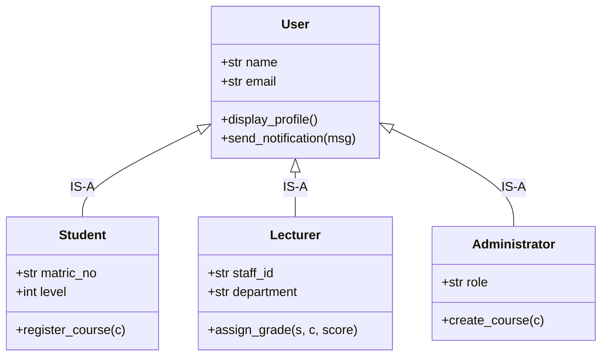

# Lecture 06 — Inheritance

> **Hierarchies, Reusability, and the IS-A Relationship**

## Learning Objectives
By the end of this lecture, you will be able to:
1. Explain what **Inheritance** is and identify genuine **IS-A** relationships.
2. Define base (parent) and derived (child / subclass) classes in Python.
3. Use the `super()` function to delegate constructor and method logic to the parent class.
4. Override base class methods in child classes to specialize behavior.
5. Use `isinstance()` and `issubclass()` to verify inheritance hierarchies.
6. Identify when inheritance is appropriate and when it should be avoided.

---

## Prerequisites
- Completed [Lecture 05 — Encapsulation](05-encapsulation.md).

---

## 1. Introduction: The Problem of Duplication

In our Student Management System, we need to represent different kinds of people:
- `Student`: has `name`, `email`, `matric_no`, `level`
- `Lecturer`: has `name`, `email`, `staff_id`, `rank`
- `Administrator`: has `name`, `email`, `admin_role`, `department`

Notice that every single person shares common attributes (`name`, `email`) and common behaviors (e.g. `login()`, `display_profile()`, `update_email()`).

Instead of duplicating this code across 3 separate classes, we extract the common concept into a generalized **Base Class** (`User`), and have specialized **Subclasses** inherit from it.



---

## 2. Defining Base and Derived Classes

In Python, inheritance is declared by placing the parent class inside parentheses during class definition:

```python
# 1. Base Class (Parent)
class User:
    """Base class representing any system user."""

    def __init__(self, name: str, email: str):
        self.name = name
        self.email = email

    def display_profile(self):
        print(f"--- User: {self.name} ({self.email}) ---")

    def send_notification(self, message: str):
        print(f"[EMAIL TO {self.email}]: {message}")


# 2. Derived Class (Child)
class Student(User):
    """Student inherits all attributes and methods of User."""

    def __init__(self, name: str, email: str, matric_no: str, level: int = 100):
        # Delegate name and email initialization to the User base class
        super().__init__(name, email)
        self.matric_no = matric_no
        self.level = level

    # Method Overriding: Specialize display_profile for students
    def display_profile(self):
        print(f"=== Student Profile ===")
        print(f"Name:      {self.name}")
        print(f"Email:     {self.email}")
        print(f"Matric No: {self.matric_no}")
        print(f"Level:     {self.level}")
```

---

## 3. The Power of `super()`

`super()` returns a proxy object that delegates method calls to a parent or sibling class.

Why use `super().__init__(name, email)`?
1. **DRY Principle**: Avoids re-implementing attribute validation or assignment written in `User`.
2. **Maintainability**: If `User.__init__` adds password hashing or activity logging, all subclasses automatically benefit.
3. **Multiple Inheritance Safety**: `super()` respects Python's Method Resolution Order (MRO).

---

## 4. Expanding the Hierarchy: `Lecturer`

Let's implement the `Lecturer` subclass:

```python
class Lecturer(User):
    """Academic staff member."""

    def __init__(self, name: str, email: str, staff_id: str, department: str):
        super().__init__(name, email)
        self.staff_id = staff_id
        self.department = department
        self.assigned_courses = []

    def assign_course(self, course_code: str):
        self.assigned_courses.append(course_code)
        print(f"Course {course_code} assigned to Lecturer {self.name}.")

    def display_profile(self):
        print(f"=== Lecturer Profile ===")
        print(f"Staff Name: {self.name}")
        print(f"Staff ID:   {self.staff_id}")
        print(f"Department: {self.department}")
        print(f"Teaching:   {', '.join(self.assigned_courses) or 'None'}")
```

### Demonstration:
```python
student = Student("Aisha Muhammad", "aisha@uni.edu", "GSU/CSC/001", 300)
lecturer = Lecturer("Dr. Kabir Ibrahim", "kabir@uni.edu", "STF-402", "Computer Science")

# Subclasses inherit User methods:
student.send_notification("Your fee receipt is ready.")
lecturer.send_notification("Senate meeting scheduled for Thursday.")

# Subclasses execute their own specialized display_profile:
student.display_profile()
lecturer.display_profile()
```

---

## 5. Type Introspection with `isinstance()` and `issubclass()`

```python
# isinstance checks object instances
print(isinstance(student, Student))    # True
print(isinstance(student, User))       # True (Student IS-A User)
print(isinstance(student, Lecturer))   # False

# issubclass checks class relationships
print(issubclass(Student, User))       # True
print(issubclass(Lecturer, User))      # True
print(issubclass(Student, Lecturer))   # False
```

---

## 6. When to Use (and Avoid) Inheritance

Inheritance is one of the most misused features in beginner OOP.

### ✅ Good use of Inheritance:
- True **IS-A** relationship: `Student IS-A User`, `Circle IS-A Shape`, `DebitCard IS-A PaymentMethod`.
- Subclasses adhere to the interface of the parent class (Liskov Substitution Principle).

### ❌ Bad use of Inheritance:
- Reusing code for non-related concepts: `Car` inheriting from `Engine` (A car is NOT an engine; a car HAS an engine!).
- Subclasses breaking or disabling parent methods (e.g. `Bird` class having `fly()`, but `Penguin` class raises `NotImplementedError`).

> **Golden Rule**: If the phrase *"Child IS A Parent"* sounds unnatural or violates logic, use **Composition** instead!

---

## 7. Interactive Learning & Activities

### 🤔 Think About It
> Should `Course` inherit from `Department`?
> *No! A Course IS NOT a Department. A Course belongs to / is offered by a Department (Association / Composition).*

### 💬 Discuss
> If `User` has a `change_password(new_pass)` method, do `Student` and `Lecturer` automatically get it? Why?

### 💻 Code Along: Extending Parent Method Behavior
Sometimes you don't want to completely replace the parent method, but rather extend it:

```python
class Parent:
    def greet(self):
        print("Hello from Base!")

class Child(Parent):
    def greet(self):
        super().greet() # Call base first!
        print("...and greetings from Child!")

Child().greet()
```

### 🔍 Debug This
Why does the following code crash?

```python
class User:
    def __init__(self, name: str):
        self.name = name

class Student(User):
    def __init__(self, name: str, matric: str):
        # BUG: Forgot super().__init__(name) or called without args!
        self.matric = matric

s = Student("Aisha", "CSC001")
print(s.name) # AttributeError: 'Student' object has no attribute 'name'
```

---

## 8. Knowledge Check & Quiz

1. **What function is used to invoke the parent class constructor in Python?**
   - A) `parent()`
   - B) `this()`
   - C) `super()`
   - D) `base()`
   *(Answer: C)*

2. **If class `B` inherits from class `A`, and `obj = B()`, what does `isinstance(obj, A)` return?**
   - A) `False`
   - B) `True`
   - C) `TypeError`
   - D) `None`
   *(Answer: B)*

3. **When a child class defines a method with the exact same name as a parent class method, this is called:**
   - A) Method overloading
   - B) Method overriding
   - C) Method encapsulation
   - D) Recursion
   *(Answer: B)*

---

## 9. Common Mistakes
- **Forgetting to invoke `super().__init__(...)`**: Leaves inherited attributes uninitialized.
- **Forcing inheritance where composition belongs**: e.g., inheriting `Student` from `Course` instead of storing courses in a list.
- **Deep and brittle inheritance trees**: Creating 5-6 levels of inheritance makes systems fragile and difficult to refactor.

---

## 10. Homework & Exercises
- Complete [Exercise 06 — Inheritance](../exercises/06-inheritance/README.md).
- Read [Lecture 07 — Polymorphism](07-polymorphism.md).
