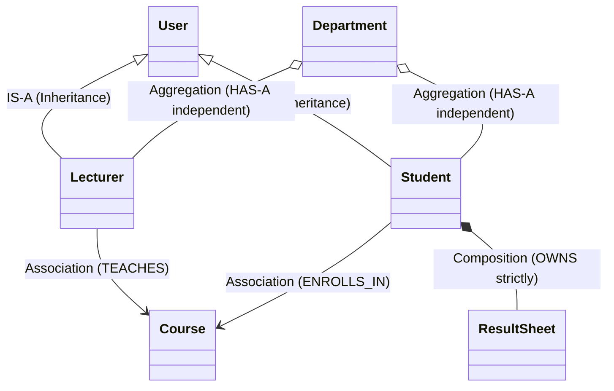

# Lecture 09 — Composition, Association, and Aggregation

> **Object Relationships: Favoring Composition over Inheritance**

## Learning Objectives
By the end of this lecture, you will be able to:
1. Explain why **"Favor Object Composition over Class Inheritance"** is a foundational rule of software design.
2. Distinguish between the four major object relationships:
   - **IS-A** (Inheritance)
   - **HAS-A** (Composition)
   - **AGGREGATES** (Aggregation)
   - **USES / INTERACTS WITH** (Association)
3. Model complex systems using composition and aggregation.
4. Prevent lifecycle coupling and memory leaks in relational object models.

---

## Prerequisites
- Completed [Lecture 06 — Inheritance](06-inheritance.md) and [Lecture 08 — Abstraction](08-abstraction.md).

---

## 1. Introduction: The 4 Object Relationships

In real-world software, objects do not live in isolation. They collaborate.

| Relationship | Type | Multiplicity / Meaning | Real-world SMS Example |
| :--- | :--- | :--- | :--- |
| **Inheritance** | `IS-A` | Derived class is a specialized type of base class | `Student IS-A User` |
| **Composition** | `HAS-A` (Strong ownership) | Part cannot meaningfully exist without the Whole | `Result HAS-A CourseGradeRecord` |
| **Aggregation** | `HAS-A` (Weak ownership) | Container has elements, but elements have independent lifecycles | `Department HAS Students` |
| **Association** | `USES-A` | Objects know about each other and interact | `Lecturer TEACHES Course` |



---

## 2. Why Favor Composition Over Inheritance?

Inheritance creates **tight compile-time coupling**. If you change a method signature in a base class, every child class can break.

Composition creates **loose runtime flexibility**. You can swap out behaviors, delegate tasks, and combine small, focused classes dynamically.

### Bad Design with Inheritance:
```python
# What if we need a Teaching Assistant (TA) who is BOTH a Student and a Lecturer?
# Multiple inheritance quickly becomes messy and fragile!
```

### Clean Design with Composition:
```python
class Role:
    def __init__(self, title: str):
        self.title = title

class User:
    def __init__(self, name: str, email: str):
        self.name = name
        self.email = email
        self.roles = [] # Composing multiple roles!

    def add_role(self, role: Role):
        self.roles.append(role)
```

---

## 3. Modeling the Course and Department System

Let's build a clean domain model demonstrating all 4 relationships:

### 3.1 The Course Class (Independent Entity)
```python
class Course:
    """Represents an academic course."""

    def __init__(self, code: str, title: str, credit_units: int):
        self.code = code
        self.title = title
        self.credit_units = credit_units

    def __repr__(self) -> str:
        return f"<Course {self.code}: {self.title} ({self.credit_units}U)>"
```

### 3.2 Association: Lecturer TEACHES Course
```python
class Lecturer:
    """Lecturer interacts with Course (Association)."""

    def __init__(self, name: str, staff_id: str):
        self.name = name
        self.staff_id = staff_id
        self.courses_teaching = []

    def assign_course(self, course: Course):
        if course not in self.courses_teaching:
            self.courses_teaching.append(course)
            print(f"Assigned {course.code} to {self.name}")
```

### 3.3 Composition: Student HAS-A Transcript
If the `Student` object is deleted from the system, their unique internal `Transcript` is deleted with them (Strict Composition):

```python
class TranscriptRecord:
    """Internal grade record held exclusively within a transcript."""
    def __init__(self, course: Course, score: float):
        self.course = course
        self.score = score

class Transcript:
    """Belongs exclusively to one student."""
    def __init__(self):
        self.records: list[TranscriptRecord] = []

    def add_record(self, course: Course, score: float):
        self.records.append(TranscriptRecord(course, score))

    def display(self):
        for rec in self.records:
            print(f"  - {rec.course.code} ({rec.course.title}): {rec.score:.1f}")
```

### 3.4 Aggregation: Department HAS Students & Lecturers
If a `Department` is reorganized or closed down, the `Student` and `Lecturer` objects still exist independently in the university:

```python
class Department:
    """Aggregates students, lecturers, and courses."""

    def __init__(self, name: str, code: str):
        self.name = name
        self.code = code
        self.students: list = []
        self.lecturers: list[Lecturer] = []
        self.courses: list[Course] = []

    def add_student(self, student):
        self.students.append(student)

    def add_lecturer(self, lecturer: Lecturer):
        self.lecturers.append(lecturer)

    def add_course(self, course: Course):
        self.courses.append(course)

    def get_summary(self) -> str:
        return (
            f"Department of {self.name} ({self.code})\n"
            f"  - Faculty Count:  {len(self.lecturers)}\n"
            f"  - Enrolled Students: {len(self.students)}\n"
            f"  - Offered Courses:   {len(self.courses)}"
        )
```

---

## 4. Putting It All Together

```python
# 1. Independent courses
python_course = Course("CSC301", "Python OOP & Architecture", 3)
db_course = Course("CSC305", "Database Systems", 3)

# 2. Association (Lecturer teaches courses)
dr_kabir = Lecturer("Dr. Kabir Ibrahim", "STF-101")
dr_kabir.assign_course(python_course)
dr_kabir.assign_course(db_course)

# 3. Aggregation (Department organizes everything)
cs_dept = Department("Computer Science", "CSC")
cs_dept.add_course(python_course)
cs_dept.add_course(db_course)
cs_dept.add_lecturer(dr_kabir)

print(cs_dept.get_summary())
```

---

## 5. Interactive Learning & Activities

### 🤔 Think About It
> When deleting a `Department`, do the `Lecturer` objects get deleted from memory? What about when deleting a `Student` and their `Transcript`?
> *In Aggregation (`Department` -> `Lecturer`), lecturers exist independently. In Composition (`Student` -> `Transcript`), the transcript has no meaning without the student.*

### 💬 Discuss
> Why is it better to model `Car` having an `Engine` rather than `class Car(Engine):`?

### 💻 Code Along: Dynamic Strategy via Composition
```python
class StandardGrading:
    def grade(self, score: float) -> str:
        return "PASS" if score >= 40 else "FAIL"

class HonorsGrading:
    def grade(self, score: float) -> str:
        return "FIRST CLASS" if score >= 70 else "HONORS PASS"

class Student:
    def __init__(self, name: str, grading_strategy):
        self.name = name
        # Composing behavior dynamically!
        self.grading_strategy = grading_strategy

    def evaluate(self, score: float) -> str:
        return self.grading_strategy.grade(score)

s = Student("Aisha", HonorsGrading())
print(s.evaluate(85)) # FIRST CLASS

# Swap strategy at runtime!
s.grading_strategy = StandardGrading()
print(s.evaluate(85)) # PASS
```

### 🔍 Debug This
What design issue is present in this inheritance structure?

```python
class Database:
    def connect(self): pass
    def execute_query(self, q): pass

# BAD DESIGN: Student IS NOT A Database!
class Student(Database):
    def __init__(self, name):
        super().__init__()
        self.name = name
```

**Fix:** Pass `Database` as a collaborator or dependency to `StudentRepository`, rather than inheriting!

---

## 6. Knowledge Check & Quiz

1. **Which relationship represents strong ownership where the child cannot exist without the parent?**
   - A) Aggregation
   - B) Association
   - C) Composition
   - D) Duck Typing
   *(Answer: C)*

2. **In the phrase "Department HAS Students", what relationship is represented if students can exist even if the department is deleted?**
   - A) Inheritance
   - B) Aggregation
   - C) Recursion
   - D) Abstraction
   *(Answer: B)*

3. **What is the main problem with deep inheritance trees?**
   - A) Python does not support inheritance
   - B) High coupling, fragility, and inability to change parent behavior without breaking children
   - C) Subclasses cannot define attributes
   - D) Code size is reduced
   *(Answer: B)*

---

## 7. Common Mistakes
- **Inheriting for code reuse instead of subtyping**: Using inheritance when composition (`HAS-A`) is the correct conceptual model.
- **Tight circular references**: Having object A store B and B store A without clear lifecycle boundaries.
- **God objects**: Creating one giant `System` class that directly instantiates and controls every single object.

---

## 8. Key Takeaways
- **IS-A** = Inheritance (Strict subtyping).
- **HAS-A** = Composition (Strict ownership) or Aggregation (Shared/independent elements).
- **USES-A** = Association (Interaction/Collaboration).
- Default to **Composition**: It produces flexible, testable, and loosely coupled architectures.

---

## 9. Homework & Exercises
- Complete [Exercise 09 — Composition](../exercises/09-composition/README.md).
- Read [Lecture 10 — Class Methods and Static Methods](10-class-static-methods.md).
