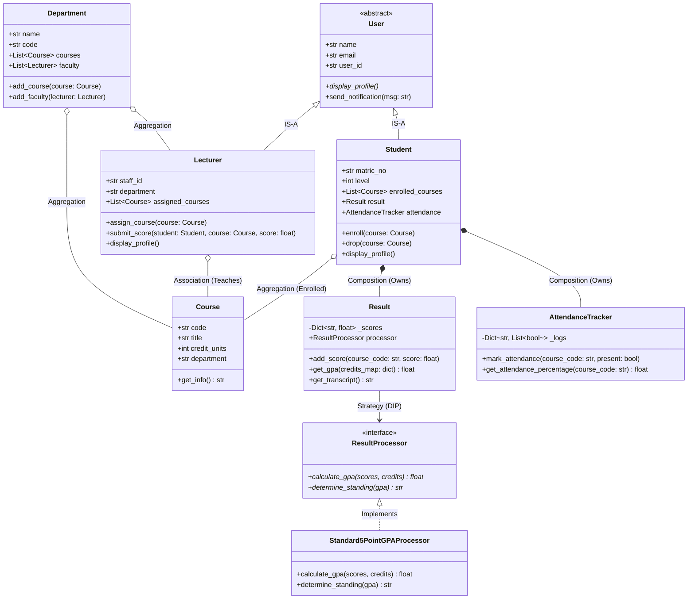

# Lecture 12 — OOP Design with the Student Management System

> **From Requirements to Architecture: End-to-End System Modeling**

## Learning Objectives
By the end of this lecture, you will be able to:
1. Translate a textual business problem into a clear domain model.
2. Systematically identify **Entities**, **Attributes**, **Behaviors**, **Responsibilities**, and **Relationships**.
3. Choose appropriately between Inheritance, Composition, Aggregation, and Association.
4. Draw and interpret UML Class Diagrams with Mermaid.
5. Review the complete architecture of the practical Student Management System before examining its code.

---

## Prerequisites
- Completed Lectures 01 through 11.

---

## 1. The Scenario & Problem Statement

> **University Administration Requirement:**
> "Our university requires a software system to manage academic operations.
> We have two primary types of users: **Students** and **Lecturers**.
> Students enroll in **Courses**, attend lectures, receive scores, and have their **GPA** and academic standing calculated.
> Lecturers belong to a **Department**, teach specific Courses, and submit student assessment scores.
> The system must track student **Attendance** for each course, compute attendance percentages, and ensure strict validation rules (scores between 0-100, attendance dates valid, valid matriculation codes)."

---

## 2. Step-by-Step Modeling Workflow

```text
Problem Statement
       ↓
Identify Nouns & Verbs
       ↓
Extract Domain Entities (Classes)
       ↓
Define State (Attributes) & Actions (Methods)
       ↓
Establish Relationships (IS-A, HAS-A, USES)
       ↓
Apply Encapsulation & Polymorphism
       ↓
System Architecture & Implementation
```

---

## 3. Entity & Responsibility Breakdown

### Step 1: Identifying Candidates
- **Nouns**: User, Student, Lecturer, Department, Course, Score, Result, Attendance, GPA.
- **Verbs**: Register, Enroll, Teach, Submit Score, Calculate GPA, Record Attendance.

### Step 2: Formal Entity Specifications

| Entity / Class | Core Responsibility | Attributes | Methods |
| :--- | :--- | :--- | :--- |
| **`User`** (Base) | Demographic identity & communication | `name`, `email`, `user_id` | `display_profile()`, `send_notification()` |
| **`Student`** (Derived) | Student-specific state & course tracking | `matric_no`, `level`, `enrolled_courses`, `result` | `enroll()`, `drop()`, `get_summary()` |
| **`Lecturer`** (Derived) | Faculty state & teaching assignments | `staff_id`, `department`, `assigned_courses` | `assign_course()`, `submit_score()` |
| **`Course`** | Course catalog unit details | `code`, `title`, `credit_units`, `department` | `get_course_info()` |
| **`Department`** | Organizational grouping of courses & faculty | `name`, `code`, `head_of_dept` | `add_course()`, `add_lecturer()` |
| **`Result`** | Managing student scores and GPA | `scores`, `processor` | `add_score()`, `compute_gpa()`, `get_transcript()` |
| **`AttendanceTracker`** | Session attendance logs & percentages | `attendance_logs` | `mark_present()`, `mark_absent()`, `get_percentage()` |

---

## 4. Complete System UML Architecture



---

## 5. Architectural Highlights

1. **Clean Separation of Concerns**:
   - `Student` does not calculate GPA formulas directly; it delegates to its composed `Result` object.
   - `Result` does not hardcode grading rules; it relies on an injected `ResultProcessor` strategy.
2. **Encapsulation & Protection**:
   - `_scores` in `Result` and `_logs` in `AttendanceTracker` are protected against direct external modification.
3. **Extensibility**:
   - If the university switches to a 4.0 GPA scale or Percentage scale, we only need to implement a new `ResultProcessor` subclass without altering `Student`, `Course`, or `Result`!

---

## 6. Interactive Design Review

### 💬 Discuss
1. Why is `Student` composed of `Result` rather than inheriting from `Result`?
   - *A Student IS NOT a Result. A Student HAS a Result.*
2. Why is `Course` aggregated rather than strictly composed in `Student`?
   - *If a student withdraws or deletes their profile, the Course itself (e.g. `CSC301`) still exists in the catalog.*

---

## 7. Key Takeaways
- Domain modeling translates business requirements into clean entities, attributes, and relationships.
- UML class diagrams give clarity on boundaries, ownership, and data flow before writing code.
- Prefer composition for subsystem parts (`Result`, `AttendanceTracker`) and association/aggregation for shared catalog items (`Course`, `Department`).

---

## 8. Next Step
Explore the complete implementation of this architecture in:
- [projects/student-management-system/](file:///home/adamsgeeky/Documents/Geekink/Geekink-Institude/Interns/PythonBootcamp/python-oop/projects/student-management-system)
- [Lecture 13 — Final Capstone Project](13-final-project.md)
