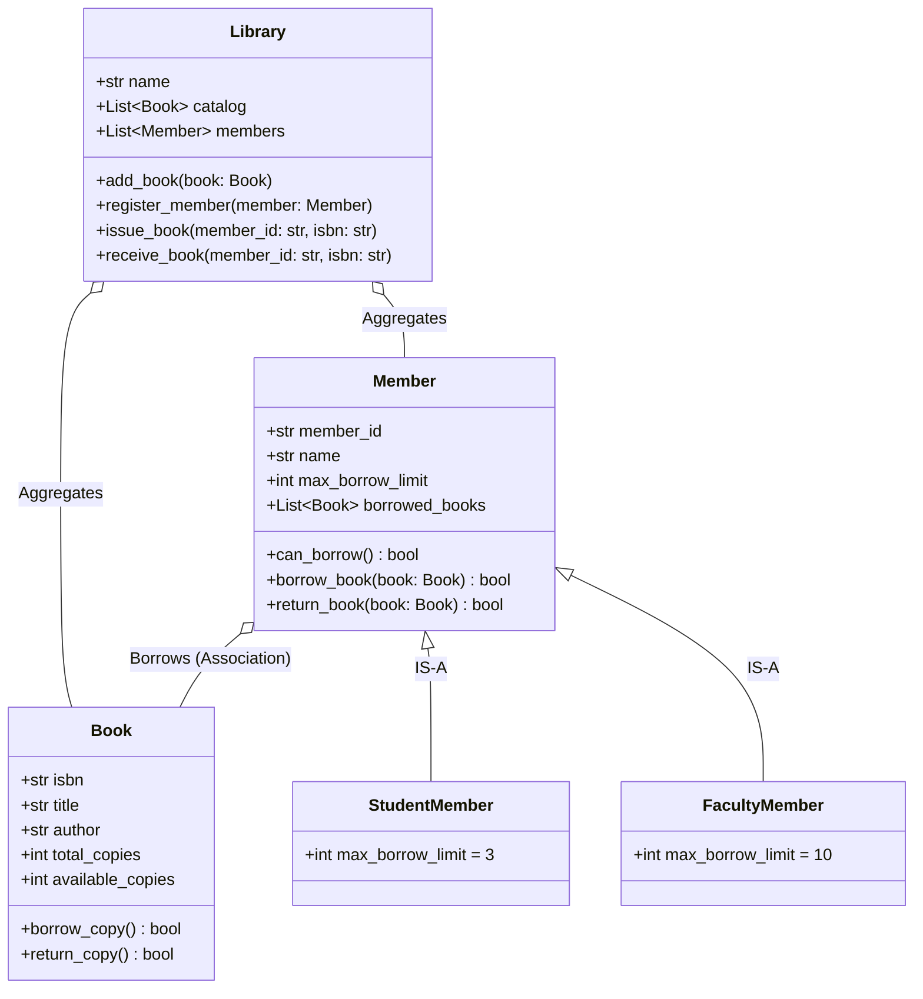

# Assignment 01 — Library Management System

> **Managing Catalog State, Member Limits, and Borrowing Invariants**

## 1. Project Overview
A university library needs an automated system to catalog physical books, manage registered members, and enforce strict borrowing and return policies.

---

## 2. Domain Entities & Responsibilities

---

## 3. Detailed Functional Requirements

### 3.1 Book Class
- Attributes: `isbn` (unique string), `title` (str), `author` (str), `total_copies` (int).
- Properties:
  - `available_copies`: Protected counter (`_available_copies`) initialized to `total_copies`.
  - `is_available`: Boolean returning `self.available_copies > 0`.
- Methods:
  - `borrow_copy()`: Decrements `_available_copies` if `> 0`, else raises `ValueError("No copies available")`.
  - `return_copy()`: Increments `_available_copies` up to `total_copies`.

### 3.2 Member Hierarchy
- Base class `Member`:
  - Attributes: `member_id`, `name`, `borrowed_books` (list).
  - Abstract/configurable limit: `max_borrow_limit`.
  - Methods:
    - `can_borrow() -> bool`: Returns `len(self.borrowed_books) < self.max_borrow_limit`.
    - `borrow_book(book: Book)`: Validates `can_borrow()` and appends to `borrowed_books`.
    - `return_book(book: Book)`: Removes book from `borrowed_books`.
- Subclasses:
  - `StudentMember`: `max_borrow_limit = 3`
  - `FacultyMember`: `max_borrow_limit = 10`

### 3.3 Library Class
- Manages `catalog` (dictionary or list of `Book` objects) and `members` (dictionary of `Member` objects).
- Methods:
  - `add_book(book: Book)`
  - `register_member(member: Member)`
  - `issue_book(member_id: str, isbn: str)`: Executes end-to-end transaction (validates member, verifies book availability, invokes member borrow and book borrow).
  - `receive_book(member_id: str, isbn: str)`: Executes return transaction.

---

## 4. Evaluation Checklist
- [ ] Invariant: A book's `available_copies` cannot drop below `0` or exceed `total_copies`.
- [ ] Invariant: A member cannot exceed their specific borrowing limit.
- [ ] Inheritance: Clean subclassing of `Member` with `StudentMember` and `FacultyMember`.
- [ ] Tests: Unit tests verifying concurrent borrows and limit violations.
