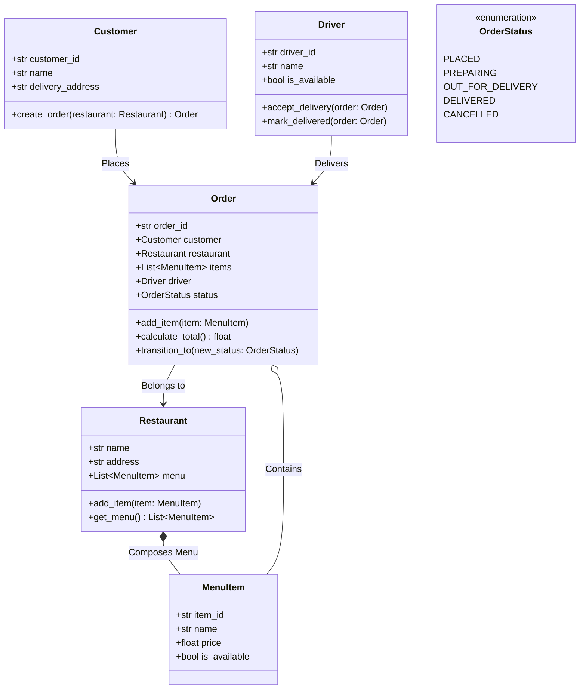

# Assignment 02 — Food Delivery System

> **Multi-Entity Collaboration, State Machines, and Order Lifecycles**

## 1. Project Overview
Design an online food delivery backend system (similar to Chowdeck or UberEats) connecting Customers, Restaurants, Menus, Orders, and Delivery Drivers.

---

## 2. Domain Entities & UML Diagram

---

## 3. Core Functional Requirements

### 3.1 MenuItem & Restaurant
- `MenuItem`: Represents individual dishes with price validation (`price > 0`).
- `Restaurant`: Contains a menu of `MenuItem` objects (Composition). Supports adding items and querying availability.

### 3.2 Order Lifecycle Management
- An `Order` starts in `OrderStatus.PLACED`.
- State transitions must follow valid sequential flow:
  - `PLACED` -> `PREPARING` -> `OUT_FOR_DELIVERY` -> `DELIVERED`.
  - Illegal state transitions (e.g. `DELIVERED` -> `PREPARING`) must raise an `InvalidStateTransitionError`.

### 3.3 Driver Assignment
- A `Driver` can only be assigned to one active delivery at a time.
- When an order transitions to `OUT_FOR_DELIVERY`, an available driver is assigned and marked unavailable.
- When `mark_delivered` is invoked, the order is marked `DELIVERED` and the driver becomes available again.

---

## 4. Evaluation Checklist
- [ ] Proper use of Enums / Constants for order states.
- [ ] Strict state transition validations.
- [ ] Accurate computation of subtotal, delivery fees, and order totals.
- [ ] Clear separation between Customer, Restaurant, Order, and Driver responsibilities.
