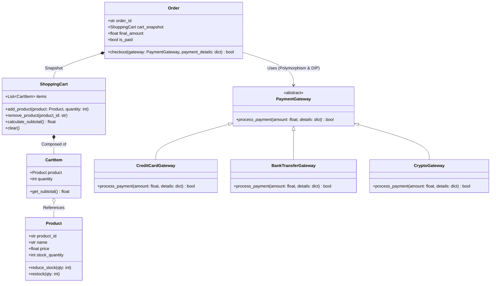

# Assignment 03 — E-Commerce System

> **Encapsulation, Composition, and Polymorphic Payment Gateways**

## 1. Project Overview
Build the object model for an e-commerce platform that manages products with stock tracking, handles shopping carts, calculates order totals with discount strategies, and processes transactions across multiple payment gateways.

---

## 2. Domain Model & UML

---

## 3. Core Functional Requirements

### 3.1 Product & Stock Encapsulation
- `Product`: Validates price (`> 0`) and stock (`>= 0`).
- `reduce_stock(quantity)`: Ensures stock is sufficient; raises `InsufficientStockError` if `quantity > stock_quantity`.

### 3.2 Shopping Cart & Cart Items
- `CartItem`: Encapsulates a product and quantity, computing subtotal dynamically.
- `ShoppingCart`: Provides `add_product`, `remove_product`, `get_total()`.
- Updating quantity of an existing product in the cart should modify the existing `CartItem` rather than adding a duplicate item.

### 3.3 Polymorphic Payment Processing (DIP)
- Abstract Base Class `PaymentGateway(ABC)` defines `@abstractmethod process_payment(...)`.
- Concrete implementations:
  - `CreditCardGateway`: Verifies card number length and expiry date.
  - `BankTransferGateway`: Generates a dynamic reference number and simulates bank webhook confirmation.
  - `CryptoGateway`: Generates a wallet address and simulates on-chain confirmation.
- The `Order.checkout(gateway: PaymentGateway)` method operates polymorphically on any gateway conforming to the contract.

---

## 4. Evaluation Checklist
- [ ] Cart accurately prevents adding more items than available in product stock.
- [ ] Checkout reduces product inventory permanently upon payment success.
- [ ] At least three distinct payment gateways implemented via ABC inheritance.
- [ ] Complete automated test suite testing cart manipulation and payment failures.
