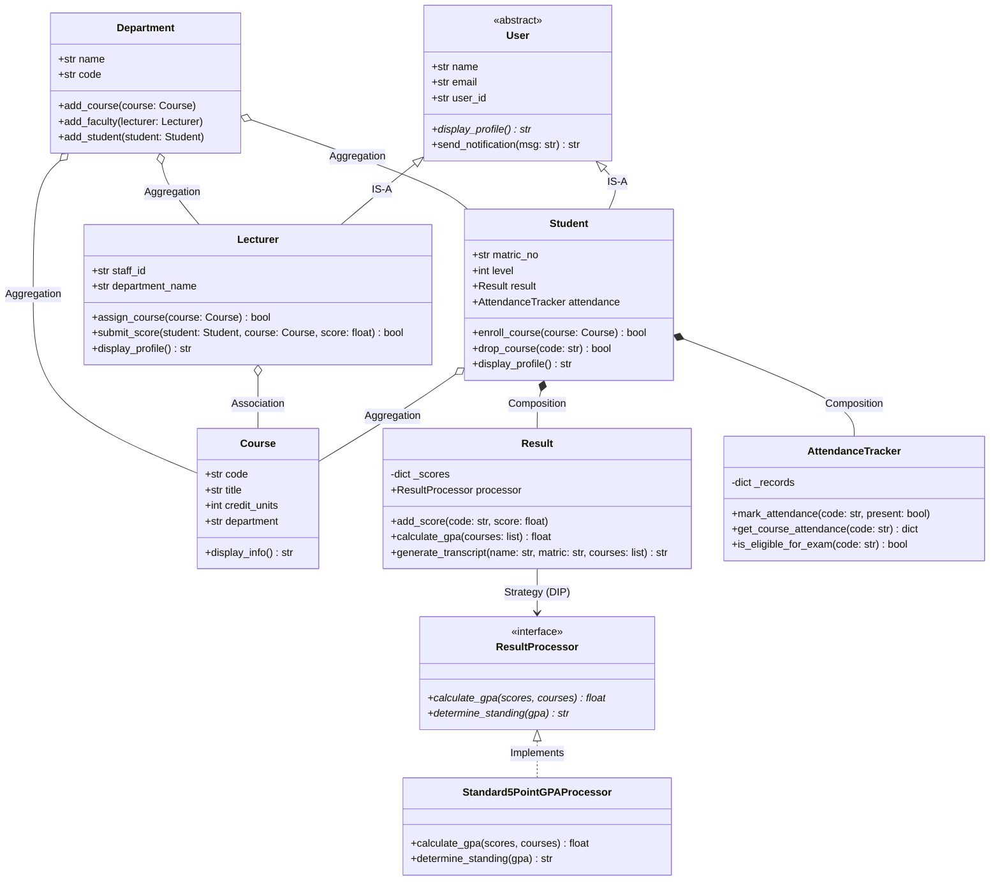

# 🎓 Student Management System (SMS)

> **A Reference Object-Oriented Architecture for Academic Management in Python**

---

## 📖 Overview
The **Student Management System (SMS)** is the primary running project designed to teach and demonstrate modern **Object-Oriented Programming (OOP) and Software Architecture in Python**.

Rather than treating OOP as abstract syntax rules, this project models real-world academic institutions: **Students**, **Lecturers**, **Courses**, **Departments**, **Assessments**, and **Attendance Records**.

---

## 🎯 Learning Philosophy
> **"Don't just write classes — learn to model problems."**

```text
Problem
   ↓
Entities
   ↓
Data (State)
   ↓
Behavior (Methods)
   ↓
Responsibilities
   ↓
Relationships (IS-A, HAS-A, USES)
   ↓
Classes & Objects
   ↓
Working System
```

---

## 🏛️ OOP Concepts Demonstrated

| Concept | Implementation in SMS | Location |
| :--- | :--- | :--- |
| **Encapsulation** | Protected state (`_scores`, `_records`), defensive copy properties | [`src/result.py`](src/result.py), [`src/attendance.py`](src/attendance.py) |
| **Properties** | Validated setters for levels/emails, computed properties for `total_credits` | [`src/student.py`](src/student.py), [`src/user.py`](src/user.py) |
| **Inheritance** | `User` base class inherited by `Student` and `Lecturer` using `super()` | [`src/user.py`](src/user.py), [`src/student.py`](src/student.py) |
| **Method Overriding** | Specialized `display_profile()` across different user roles | [`src/student.py`](src/student.py), [`src/lecturer.py`](src/lecturer.py) |
| **Polymorphism** | Processing lists of diverse `User` objects with uniform interface | [`src/main.py`](src/main.py) |
| **Abstraction** | `ResultProcessor(ABC)` contract enforcing GPA calculations | [`src/result.py`](src/result.py) |
| **Composition** | `Student` strictly owns `Result` and `AttendanceTracker` | [`src/student.py`](src/student.py) |
| **Aggregation** | `Department` aggregates independent `Course` and `Student` objects | [`src/course.py`](src/course.py) |
| **Association** | `Lecturer` teaches `Course` and submits grades for `Student` | [`src/lecturer.py`](src/lecturer.py) |
| **Dependency Inversion**| `Result` depends on abstract `ResultProcessor` strategy | [`src/result.py`](src/result.py) |

---

## 🧱 Architecture & Class Diagram



---

## 📂 Project Structure

```text
student-management-system/
├── Readme.md              # Project documentation (this file)
├── requirements.md        # Detailed functional & non-functional requirements
├── architecture.md        # Architectural subsystems and data flow
├── design.md              # Domain design and design decisions
│
├── src/                   # Source code package
│   ├── __init__.py        # Module exports
│   ├── user.py            # Abstract Base User class
│   ├── course.py          # Course & Department catalog classes
│   ├── student.py         # Student entity (inherits User, composes Result/Attendance)
│   ├── lecturer.py        # Lecturer entity (inherits User, teaches courses)
│   ├── result.py          # Result manager and Strategy ResultProcessor ABC
│   ├── attendance.py      # Attendance tracker and exam eligibility
│   └── main.py            # Interactive demonstration entrypoint
│
├── tests/                 # Automated unit tests (100% standard unittest)
│   ├── __init__.py
│   ├── test_student.py
│   ├── test_lecturer.py
│   ├── test_course.py
│   ├── test_result.py
│   ├── test_attendance.py
│   └── test_polymorphism.py
│
└── examples/              # Runnable usage examples
    ├── basic_usage.py
    └── advanced_workflow.py
```

---

## 🚀 Getting Started

### 1. Run the Interactive Demonstration
```bash
python3 -m src.main
```

### 2. Run All Automated Tests
```bash
python3 -m unittest discover -s tests -p "test_*.py"
```

### 3. Run Usage Examples
```bash
python3 examples/basic_usage.py
python3 examples/advanced_workflow.py
```

---

## 💡 Student Extension Challenges
1. **Prerequisite Enforcement**: Add a `prerequisites: List[Course]` attribute to `Course` and prevent a student from enrolling unless they previously passed the prerequisite course with a score >= 40.
2. **Semester Transcript Tracking**: Refactor `Result` to organize scores by `Semester` (e.g. `Harmattan 2025/2026`, `Rain 2025/2026`) and compute both Sessional GPA and Cumulative CGPA.
3. **Database Persistence**: Implement a `StudentRepository(ABC)` and provide an `InMemoryStudentRepository` and `JSONFileStudentRepository` following Dependency Inversion.
