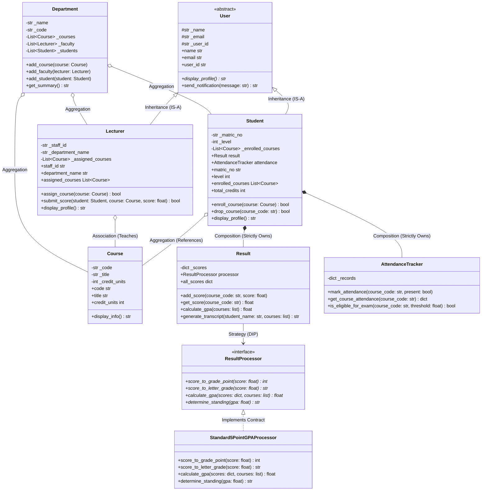

# Student Management System — Detailed Domain Design

> **Class Blueprints, Design Decisions, Invariant Rules, and UML Diagrams**

---

## 1. Domain Model Class Diagram

---

## 2. Key Design Decisions & Trade-Offs

### 2.1 Why Composition for `Result` and `AttendanceTracker`?
- A `Student` is neither a `Result` nor an `AttendanceTracker` (violating `IS-A`).
- By composing these components into `Student`, we keep the `Student` class clean and focused on identity and course tracking (SRP), delegating grading algorithms and attendance logs to specialized domain objects.

### 2.2 Why Dependency Inversion on `ResultProcessor`?
- Different universities and educational systems use different grading scales (e.g. 5.0 scale in Nigeria, 4.0 scale in USA, percentage in UK, 10-point scale in India).
- By injecting `ResultProcessor` into `Result`, we can swap grading standards at runtime without changing a single line in `Student` or `Result` (Open/Closed Principle).

### 2.3 Protection of Internal Invariants
- `_scores` and `_records` dictionaries are encapsulated with private/protected naming and exposed only via copy methods, preventing external code from corrupting internal grades or attendance numbers.
